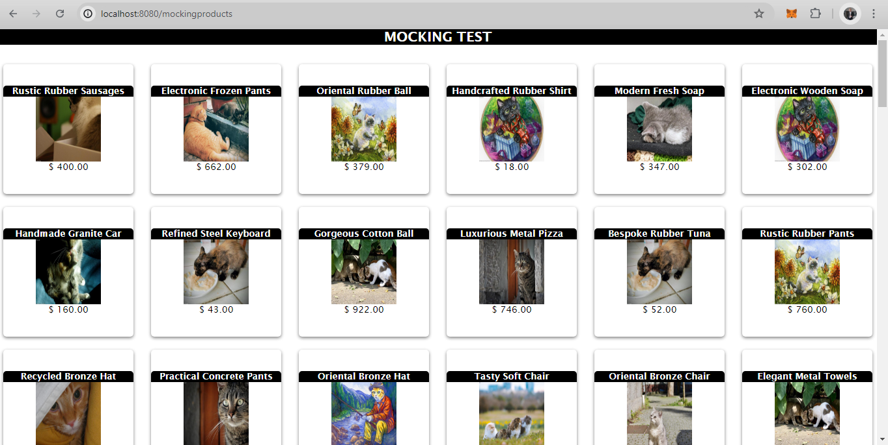

# OCTAVIO DESAFIO ENTREGABLE

**Consigna Moking:**

```
GET: http://localhost:8080/mockingproducts
```



**Consigna Custom Errors**

Aplicación:

- Carga de producto en carrito

```
POST: localhost:8080/carts/(idCarrito)/products/(idProduct)
```

Si no encuentra carrito devuelve error por terminal

- Nuevo usuario

```
POST: localhost:8080/api/sessions/register
```

Si no se completan alguno campos devuelve error por terminal

- Agregar producto a base de datos

```
POST: localhost:8080/productsManager
```

En la parte inferior del fomulario si el código ya existe en base de datos, devuelve error
