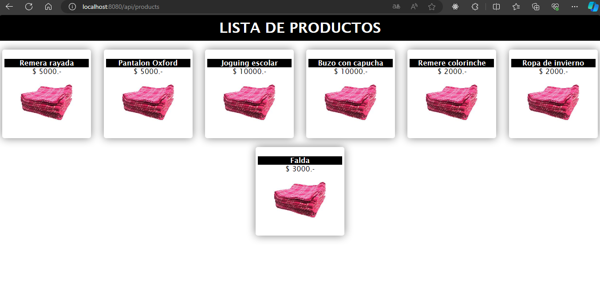
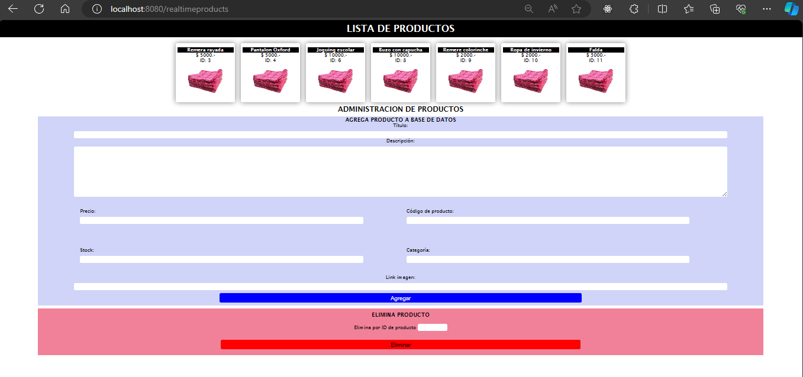
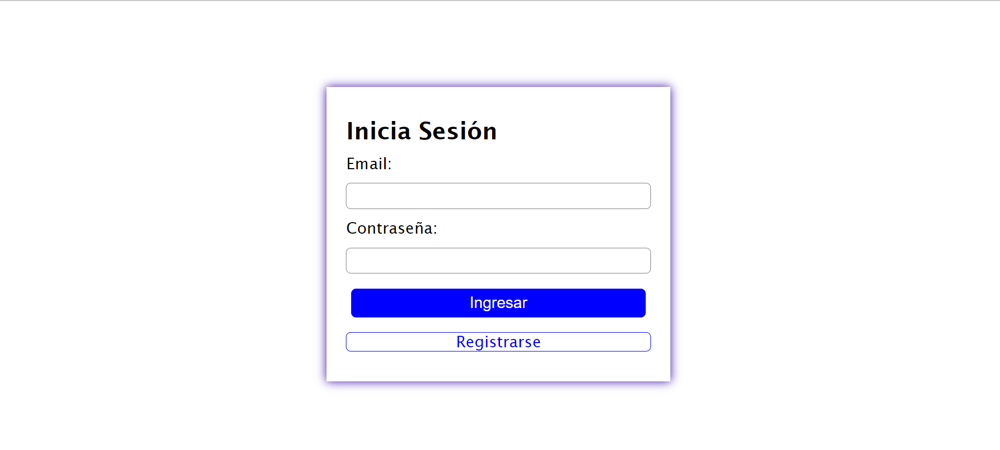
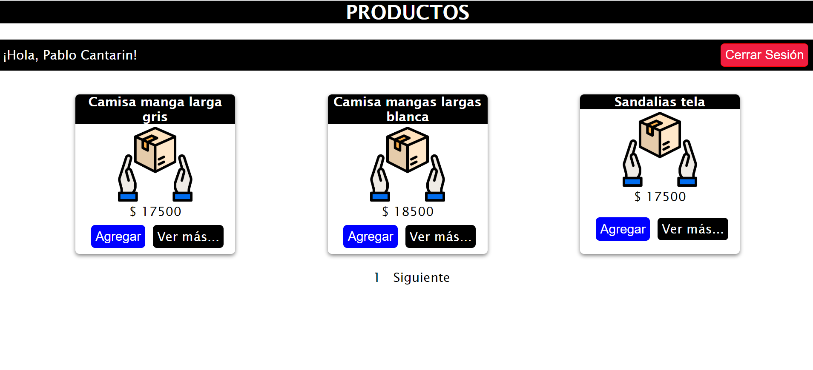
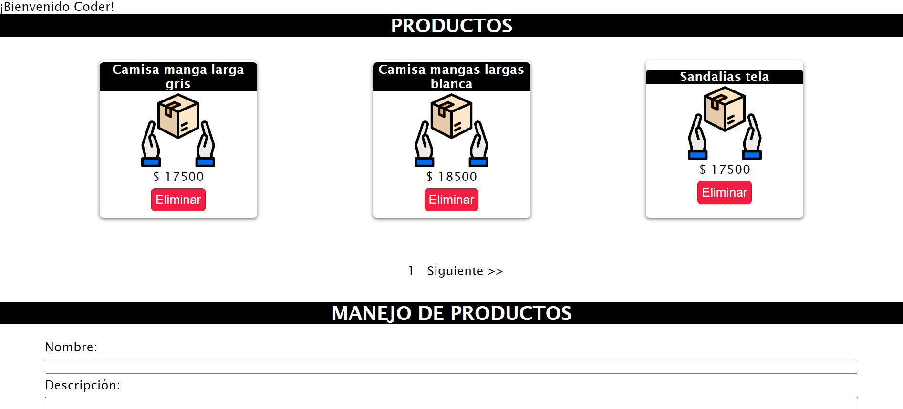
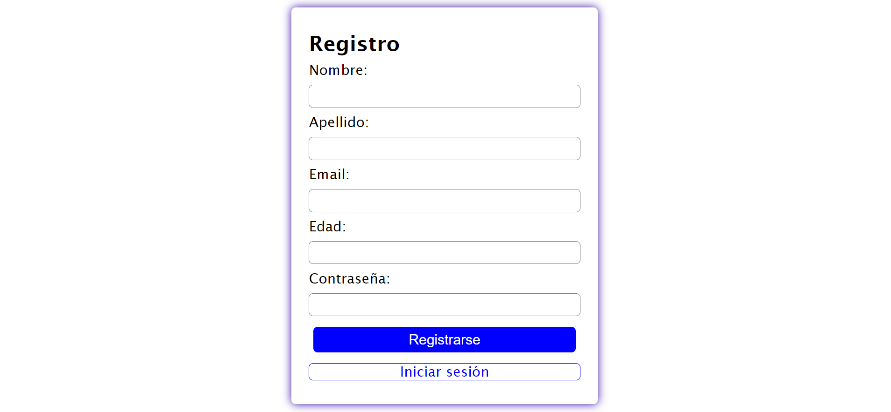

# DESAFIOS ENTREGABLES

### [Desafío entregable 1](https://github.com/Pablocan86/desafios_entregables_Cantarin_Backend/tree/main/primer_desafio_entregable)

### [Desafío entregable 2](https://github.com/Pablocan86/desafios_entregables_Cantarin_Backend/tree/main/segundo_desafio_entregable)

### [Desafío entregable 3](https://github.com/Pablocan86/desafios_entregables_Cantarin_Backend/tree/main/tercer_desafio_entregable)

### [Desafío entregable 4](https://github.com/Pablocan86/desafios_entregables_Cantarin_Backend/tree/main/cuarto_desafio_entregable/src)

### [Desafío entregable 5](https://github.com/Pablocan86/desafios_entregables_Cantarin_Backend/tree/main/sexto_desafio_entregable/src)

### [Desafío entregable 6](https://github.com/Pablocan86/desafios_entregables_Cantarin_Backend/tree/main/quinto_desafio_entregable/src)

> **_Librerias a instalar_**: npm i bcryptjs body-parser connect-mongo cookie-parser dotenv express express-handlebars express-session handlebars mongoose passport mongoose-paginate-v2 passport-github2 passport-google-oauth20 passport-local session-file-store socket.io

Para correr el servidor "npm start"

> _Productos en stock (Products.json)_

```
http://localhost:8080/api/products
```



> _Productos en stock + Formulario para agregar y quitar_

```
http://localhost:8080/realtimeproducts
```



## DESAFIO ENTREGABLE 5

### Login

```
GET: http://localhost:8080/login
```

> Si esta registrado y tiene rol de usuario lleva a /products, si es admin lleva a /productsManager



Usuario:

- Email: pablo.cantarin86@gmail.com
- Contraseña: pablito



Administrador:

- Email: coderAdmin@coder.com
- Constraseña: CODER1234



### Registro

```
GET: http://localhost:8080/register
```



## DESAFIO ENTREGABLE 6

> Al no poder subir las claves de la autenticación de GitHub y Google, se utilizó dotenv para ocultar la información

### Login

```
GET: http://localhost:8080/login
```


